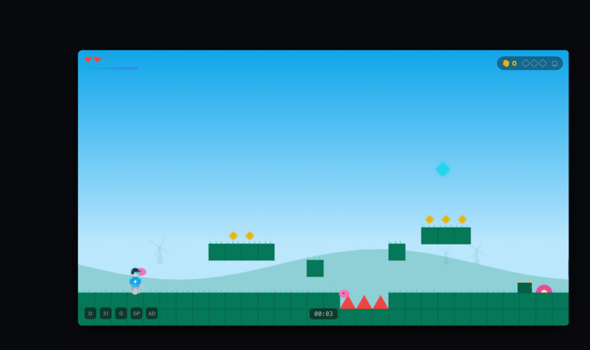
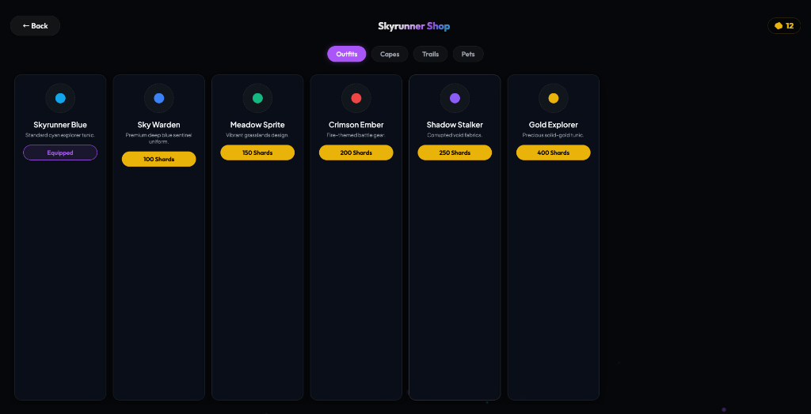
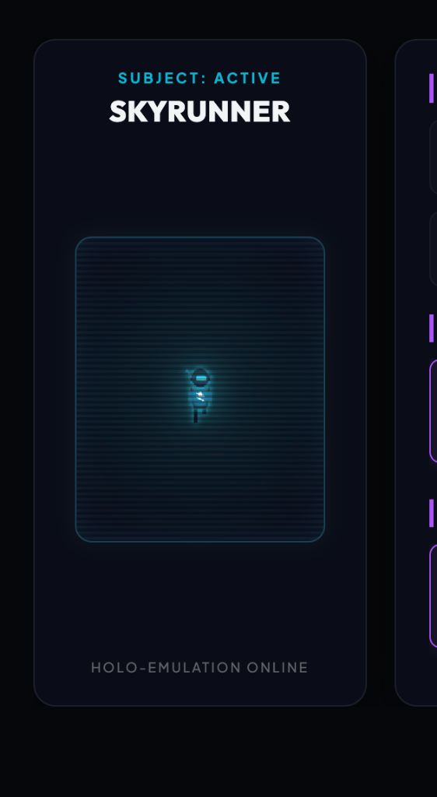
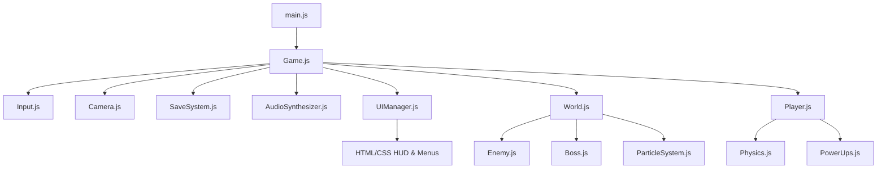

# 🌌 Skybound Realms

A high-fidelity 2D Side-Scrolling Platform Adventure game built with pure procedural technologies. It features aspect-locked responsive canvas scaling, dynamic asset-free graphics, synthesized soundtrack loops, 6 themed worlds, 4 playable character classes, and a customizable character marketplace.

---

## 🎮 Key Features

* **Zero External Network Assets**: No sprite sheets, background images, or audio files are loaded. Visuals and animations are drawn programmatically using HTML5 Canvas vector commands (`Canvas2DContext`), and sounds are generated live using Web Audio API nodes. This ensures instant loading and high performance.
* **4 Playable Classes**:
  * **Skyrunner**: Standard balanced cyber explorer. Passive: +15% double-jump height.
  * **Shadow Blade**: High-speed, high-energy assassin (2 HP). Passive: Halved air-dash cooldown.
  * **Crystal Knight**: Slow tank (4 HP). Passive: Automatically spawns with a crystal stone shield.
  * **Magma Ranger**: Balanced ranged ranger. Passive: Attacks deal fire damage. Special: Shoots explosive fireballs.
* **Weapon Skins Marketplace**: Purchase, unlock, and equip high-tech glowing weapons with unique vector geometries, custom colors, and attack sparkle particles:
  * **Runic Blade**: Alloy blade etched with class-colored energy circuits.
  * **Energy Saber**: Crackling neon plasma blade that emits electric arcs.
  * **Crystal Spear**: Resonance gem spear emitting diamond crystal sparkles.
  * **Obsidian Greatsword**: Volcanic basalt sword featuring molten magma fissure cracks.
* **Procedural Customization (Creator)**: Free color dyes (Visor, Primary, Secondary, and Accent armor colors) and unlockable parts (Helmets and Armors) with a live hologram preview rendering loop featuring Jog, Breathe, and Slash animation poses.
* **Aspect-Locked Viewport**: Maintains a perfect aspect ratio scaled to fill any display size. Unused space is padded with a beautifully rendered, parallax-scrolling nebular starfield background.

---

## 🕹️ Screenshots & Media

### Dynamic Gameplay
Explore multiple themed worlds featuring procedural block shaders, aurora effects, parallax backdrops, and massive celestial bodies.


### Playable Classes Selector
Equip specialized classes to alter stats and unlock passive traits.


### Customizer Preview & Poses
Customize outfits in real-time, pick colors, test equipped accessories, and toggle poses (Jog, Breathe, and Slash) under holographic emulation.



---

## 🎹 Game Controls

| Action | Keyboard Key | Gamepad / Mobile Touch |
| :--- | :--- | :--- |
| **Move Left / Right** | `A` / `D` or `Arrow Keys` | Left Thumb D-Pad / Stick |
| **Jump / Double Jump** | `W` / `Arrow Up` / `Space` | Jump Button (A / Cross) |
| **Interact / Strike Slash**| `E` / `F` / `J` | Attack Button (X / Square) |
| **Dash (Air Dash)** | `Shift` / `K` | Dash Button (B / Circle) |
| **Ground Pound** | `S` / `Arrow Down` (while mid-air) | Down + Jump |
| **Glide** | Hold `W` / `Arrow Up` (while mid-air) | Hold Jump Button |
| **Pause Menu** | `Escape` / `P` | Pause Menu Button |

---

## ⚙️ Project Architecture



---

## 🚀 Quick Start & Installation

### Prerequisites
Make sure you have [Node.js](https://nodejs.org/) installed.

### 1. Clone & Setup
```bash
git clone https://github.com/mithun0524/srealms.git
cd srealms
npm install
```

### 2. Run Locally in Development Mode
```bash
npm run dev
```
Open [http://localhost:3000](http://localhost:3000) in your browser to play.

### 3. Build for Production
```bash
npm run build
```
The optimized bundle will be compiled into the `dist/` directory, ready to be served by any static hosting provider.
